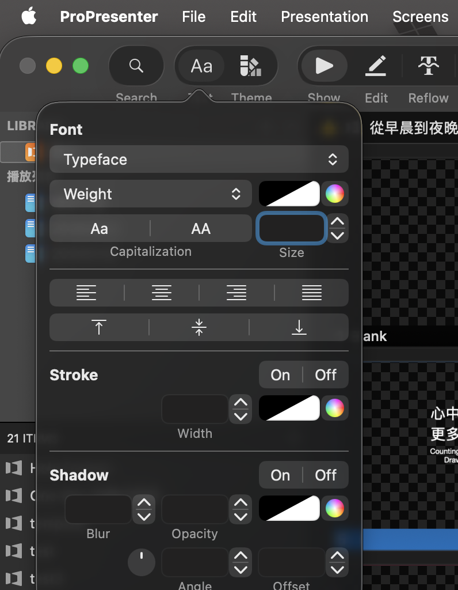

# 使用來自 Lyrics Library 的 ProPresenter 檔案

Lyrics Library 生成的檔案與 ProPresenter 略有不同，請依照以下步驟進行操作：

1. 下載檔案。

2. 將 `.pro` 檔案導入 ProPresenter。

3. 如果跳出「處理遺失字體（Resolve Missing Fonts）」的視窗，請直接選「繼續（Continue）」。

> [!WARNING]
> 請不要替代 ProPresenter 偵測到的任何字體
>
> 調整字體請[使用主題](/theme)或參見 [變更字體](#變更字體)

## 變更字體

使用編輯區左上角的文字選項，可以快速選擇你需要的字體。

> [!NOTE]
> 如果你的輸出包含複數行或文字框（雙語、雙行等），強烈建議你 [使用主題](/theme)

## 舞台螢幕（Stage）

Lyrics Library 強烈建議你使用舞台螢幕（Stage）來傳遞不同的文字給不同的螢幕，這樣可以避免在投影片上出現不必要的文字。

依靠文字框的名稱，ProPresenter 可以在連結文字時自動提取不同的文字內容。

