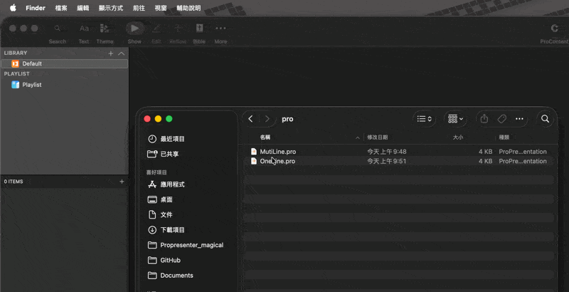
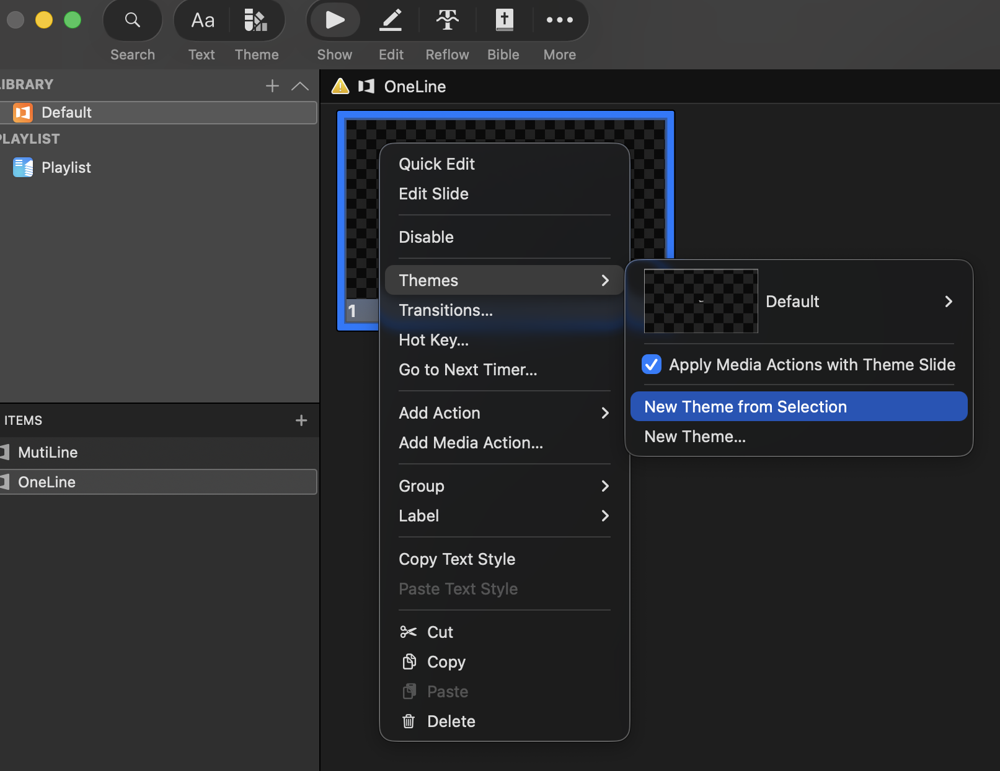
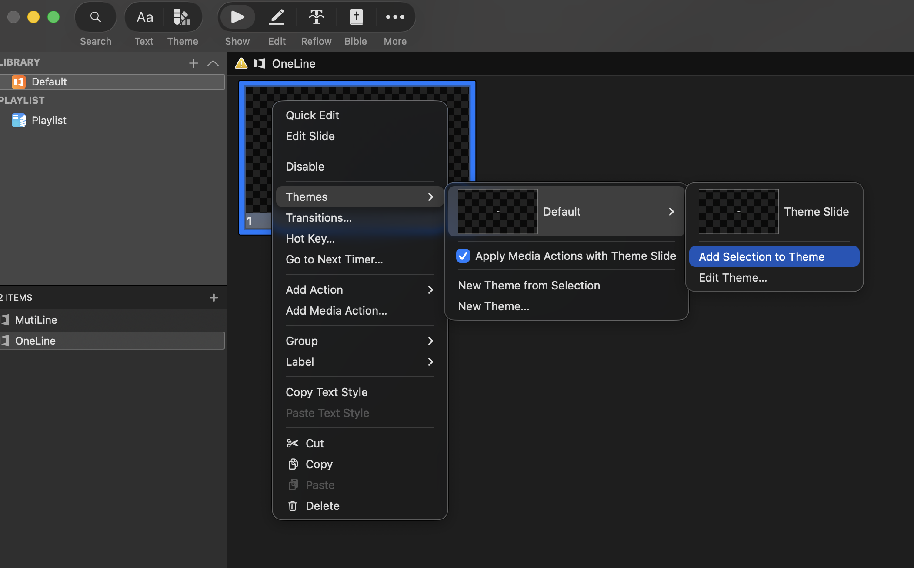
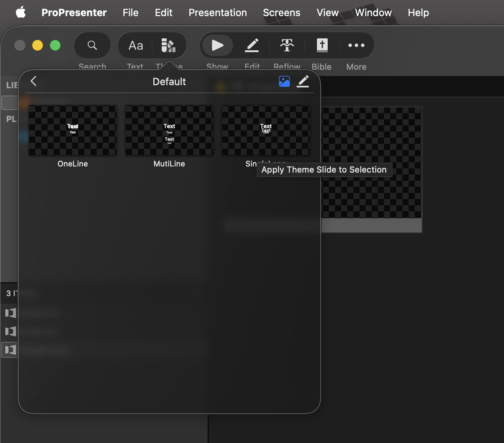

# 使用主題

「主題（Theme）」是 ProPresenter 中用來快速對投影片進行格式化和樣式設定的工具\
建立適當的主題對於「統一文字樣式」及「設定舞台螢幕內容」有很大的幫助。

本文針對以下內容進行教學，請根據需要使用：

- [來自 Lyrics Library 的主題](#來自-lyrics-library-的主題)
- [導入主題](#導入主題)
- [使用主題](#使用主題)

## 來自 Lyrics Library 的主題

如果你使用 Lyrics Library 下載 `.pro` 檔案，使用下方提供的主題進行修改會方便許多。

請確保你閱讀過 [使用來自 Lyrics Library 的 ProPresenter 檔案](/docs/prop)，並參考後續章節使用。

#### 單行主題（推薦）

> [下載](/OneLine.pro)

#### 雙行／多行

> [下載](/MutiLine.pro)

#### 單一語言

> [下載](/SingleLang.pro)

## 導入主題

1. 將 `.pro` 檔案拖曳（或導入）至 ProPresenter

2. 選擇一張投影片，右鍵選擇 `主題` -> `從已選中新增主題`

如果想加入現有的主題，可選擇主題後在下方選擇 `將所選添加到主題`

## 使用主題

有多種方式可以使用主題，以下提供兩種方式：

#### 套用至整份簡報

進入簡報，在沒有選擇投影片時點擊左上角的「主題（Theme）」選擇並套用。

#### 套用至選擇的投影片

選取一或多張投影片，點擊左上角的「主題」選擇並套用，或右鍵投影片選擇「主題」選擇並套用

> [!TIP]
> 使用 `ctrl + A` 全選\
> 按住 `ctrl` 並點選選擇不連續的投影片\
> 按住 `shift` 並點擊 A 再點擊 B 選擇 A ~ B 之間的投影片
>
> 按住 `ctrl` 時點擊不會播放投影片
> Mac 使用者請將 `ctrl` 換成 `command` 鍵

## 編輯主題

### Lyrics Library

Lyrics Library 生成的 `.pro` 會將內容分為五個不同名稱的文字框，用以套用不同的字體樣式並傳遞獨立的文字內容至舞台螢幕。

1. `Lang1`：主要語言的文字內容。
2. `Lang2`：次要語言的文字內容。
3. `Title1`：主要語言的標題內容。
4. `Title2`：次要語言的標題內容。
5. `Title3`：歌曲的創作者資訊。

在套用主題時，ProPresenter 會優先檢查投影片中是否有對應的文字框，若有則套用主題的字體樣式，若沒有會依序套用未被使用的文字框，若投影片中文字框較多則會保留原有的文字框。

> [!NOTE]
> 因此在編輯主題時，請確保文字框的名稱與上述名稱一致\
> 不要刪除任何文字框，如果你需要某個文字框不顯示，可以將其文字顏色設為透明或將其大小縮小至 0，或將其位置移出顯示範圍（推薦做法）。
